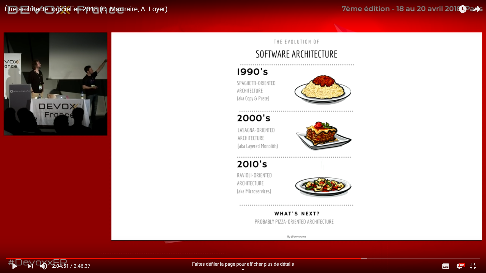
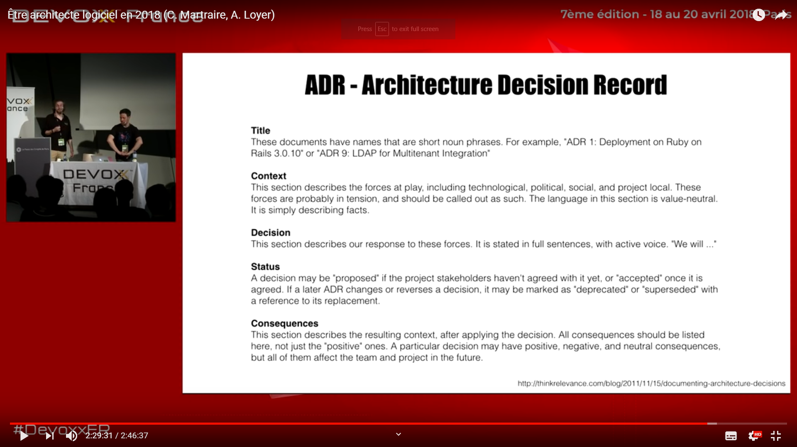

## working environment

* [12 Things You Didn't Plan for When You Hired Remote Employees](https://getlighthouse.com/blog/didnt-plan-hiring-remote-employees/)

## Cloud

* [Clever cloud](https://www.clever-cloud.com)
  French.
* [Anssi - european secure cloud label](https://www.ssi.gouv.fr/en/actualite/european-secure-cloud-a-new-label-for-cloud-service-providers/)
* [opérateurs cloud compliant secnumcloud](https://www.ssi.gouv.fr/entreprise/qualifications/prestataires-de-services-de-confiance-qualifies/prestataires-de-service-dinformatique-en-nuage-secnumcloud/)

## Tools

* [Visual Studio Live Share](https://visualstudio.microsoft.com/fr/services/live-share/?rr=https%3A%2F%2Fwww.bing.com%2F) - Pair / Mob programming online with voice support.
* [Develop remotely with Visual Studio code remote SSH](https://code.visualstudio.com/docs/remote/ssh)
* [Get rid of legacy code with Quboo gamification system](https://quboo.tpd.io/)

## Social - Communities

* [Software Crafters Strasbourg](https://www.meetup.com/Software-Crafters-Strasbourg/)
  * [@swcraftstras](https://twitter.com/swcraftstras)
  * [#swcraft](https://twitter.com/search?q=%23swcraft&src=typd)
  * [Coding Dojos](coding_dojos.md)

## Methodologies

* [7 minutes, 26 seconds, and the Fundamental Theorem of Agile Software Development](https://www.youtube.com/watch?v=WSes_PexXcA)
* [faire fonctionner une petite agence web](https://jp-lambert.me/à-laide-comment-faire-fonctionner-mon-agence-web-63cd9b9a9538)
* [Liberating Structures](https://www.liberatingstructures.fr)
* [Why is scrum not making your company very agile?](https://www.linkedin.com/feed/update/urn:li:activity:6556947030827237376)
* [Arrêtons d'être arrageants](https://blog.goood.com/2019/07/23/pour-etre-agiles-arretons-detre-arrangeants/amp/)
* [Dénicher le faux scrum agile en entretien](https://jp-lambert.me/comment-d%C3%A9nicher-le-faux-scrum-agile-en-entretien-1c8586fdcfe2)

## Operations

* [Web Hosting](hosting.md)
* [Operating Systems](operating-systems.md)
* [Linux administration](linux-administration.md)
* [Kubernetes key concepts](https://towardsdatascience.com/key-kubernetes-concepts-62939f4bc08e)

## Measuring

* [Count number of lines of code with `cloc`](https://github.com/AlDanial/cloc)
* [tests et couverture de code](https://blog.ippon.fr/2019/07/22/80-ou-90-de-couverture-de-tests/)

## Software architecture

* [CQRS](https://youtu.be/EkEz3pcLdgY)
* [No silver bullet - Frederick P. Brooks, Jr](http://worrydream.com/refs/Brooks-NoSilverBullet.pdf)
* [Build your own technology radar](https://github.com/thoughtworks/build-your-own-radar)
* [Enterprise global architecture guidelines](https://youtu.be/1igv2rHGKfo?t=8283)
* [Microservice architecture](https://youtu.be/1igv2rHGKfo?t=7614)

> [Être architecte logiciel en 2018](https://www.youtube.com/watch?v=1igv2rHGKfo) - Cyrille Martraire, Arnauld Loyer - Devoxx 2018

* [Coder sans peur du changement, avec la "même pas mal !" architecture hexagonale](https://www.youtube.com/watch?v=wZ7cxcU4iPE&t=25s)
* [Hexagonal architecture with Elixir](https://fr.slideshare.net/mobile/nicolascarlo1/hexagonal-architecture-elixir)
* [Coder sans peur du changement, avec la "même pas mal !" architecture hexagonale](https://www.youtube.com/watch?v=wZ7cxcU4iPE&t=25s)
* [DDD, en vrai pour le développeur (Cyrille Martraire)](https://www.youtube.com/watch?v=h3DLKrvp5V8)
* [Évent modeling](https://eventmodeling.org/)

## Presentations / Katas / learning

* [Presentation](presentations.md)
* [Katas](katas.md)
* [Learning](learning.md)

### Koans

* [ReasonMl](https://github.com/gabrielperales/reasonml-koans/)

## Languages

* [Python](python.md)
* [Refactor to Kotlin](https://codelabs.developers.google.com/codelabs/java-to-kotlin)
* [Elixir](elixir.md)

## Soft-skills / leadership

* [Patrick Kua - The geek's guide to leading teams](https://dev.tube/video/0PsGgnQc4eY)
* [Eric Elliott - Software Roles and Titles](https://medium.com/javascript-scene/software-roles-and-titles-e3f0b69c410c)

## Transition écologique

* [recycler 80% de ses déchets](https://m.facebook.com/story.php?story_fbid=2401188840100050&id=1459728890912721)

## Data

* [Decoupling database migrations from server startup: why and how](https://pythonspeed.com/articles/schema-migrations-server-startup/)

## Freelance

* [  booster son chiffre d'affaires avec le portage salarial    ]( https://www.linkedin.com/posts/prium-portage-555295153_les-conseils-pour-booster-son-chiffre-daffaires-ugcPost-6562964495088660480-mR5A)
* [Comparaison statuts juridiques indépendant](https://www.lecoindesentrepreneurs.fr/tableau-comparatif-des-structures-unipersonnelles/)

